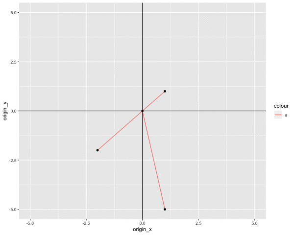
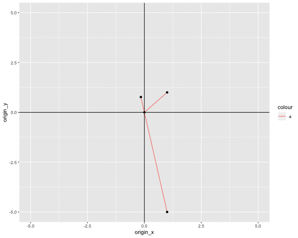

```{r}
library(ggplot2)
library(pracma)

add_vector = function(df, vector) {
  dff = data.frame(t(vector), x = 0, y = 0)
  colnames(dff) = colnames(df)
  rbind(df,  dff)
}

projection = function(X, Y) {
  dot(X, Y)/dot(X, X) * X
}

new_df =   
  data.frame(x        = 0,
             y        = 0,
             origin_x = 0,
             origin_y = 0)


```


```{r, message = FALSE, warning = FALSE}

library(animation)
## make sure ImageMagick has been installed in your system
saveGIF({
  for(i in linspace(-5, 5, 30)) {
  df = new_df
  X = c(1, 1)
  Y = c(1, i)
  df = add_vector(df, X)
  df = add_vector(df, Y)
  
  df = add_vector(df, projection(X, Y))
  
  p = ggplot(df) +
    geom_vline(xintercept = 0) +
    geom_hline(yintercept = 0) +
    geom_segment(aes(x = origin_x, y = origin_y, xend = x, yend = y, colour = 'a')) +
    geom_point(aes(x = x, y = y)) +
    xlim(-5, 5) +
    ylim(-5, 5)
  
  print(p)
}
}, movie.name = 'yonx.gif', 
   interval = 0.1,
   ani.width = 600)
```





```{r, message = FALSE, warning = FALSE}
## make sure ImageMagick has been installed in your system
saveGIF({
  for(i in linspace(-5, 5, 30)) {
  df = new_df
  X = c(1, i)
  Y = c(1, 1)
  df = add_vector(df, X)
  df = add_vector(df, Y)
  
  df = add_vector(df, projection(X, Y))
  
  p = ggplot(df) +
    geom_vline(xintercept = 0) +
    geom_hline(yintercept = 0) +
    geom_segment(aes(x = origin_x, y = origin_y, xend = x, yend = y, colour = 'a')) +
    geom_point(aes(x = x, y = y)) +
    xlim(-5, 5) +
    ylim(-5, 5)
  
  print(p)
}
}, movie.name = 'xony.gif', 
   interval = 0.1,
   ani.width = 600)
```




```{r}
 df = new_df
  X = c(1, 2)
  Y = c(1, .5)
  df = add_vector(df, X)
  df = add_vector(df, Y)
  
  df = add_vector(df, projection(matrix(1:10, nrow = 2), Y))


## make sure ImageMagick has been installed in your system
saveGIF({
  for(i in linspace(-5, 5, 30)) {
  df = new_df
  X = c(1, i)
  Y = c(1, 1)
  df = add_vector(df, X)
  df = add_vector(df, Y)
  
  df = add_vector(df, projection(X, Y))
  
  p = ggplot(df) +
    geom_vline(xintercept = 0) +
    geom_hline(yintercept = 0) +
    geom_segment(aes(x = origin_x, y = origin_y, xend = x, yend = y, colour = 'a')) +
    geom_point(aes(x = x, y = y)) +
    xlim(-5, 5) +
    ylim(-5, 5)
  
  print(p)
}
}, movie.name = 'xony.gif', 
   interval = 0.1,
   ani.width = 600)
```


```{r}
## make sure ImageMagick has been installed in your system
saveGIF({df
  
  for(i in linspace(-5, 5, 30)) {
  df = new_df
  X = c(3, 3)
  Y = matrix(c(1, i, 3, i, 1, i, 3, i, 4, i), nrow = 2)
  df = add_vector(df, X)
  df = add_vector(df, Y)
  
  df = add_vector(df, rbind(dot(X, Y)/dot(X, X), dot(X, Y)/dot(X, X))*X)
  
  p = ggplot(df) +
    geom_vline(xintercept = 0) +
    geom_hline(yintercept = 0) +
    geom_segment(aes(x = origin_x, y = origin_y, xend = x, yend = y, colour = 'a')) +
    geom_point(aes(x = x, y = y)) +
    xlim(-5, 5) +
    ylim(-5, 5)
  
  print(p)
}
}, movie.name = 'many.gif', 
   interval = 0.1,
   ani.width = 600)
```


